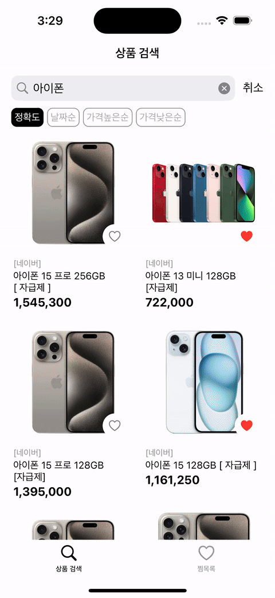
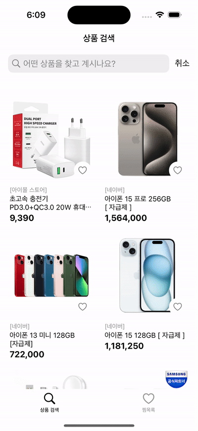
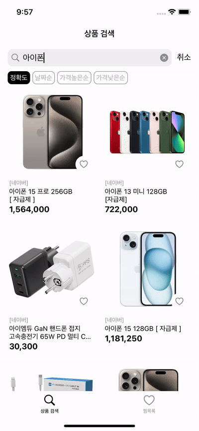
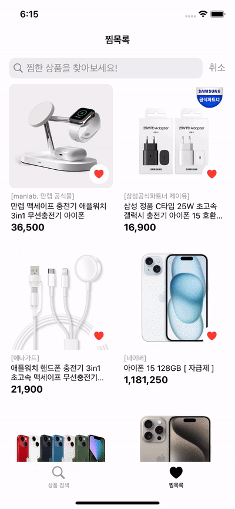
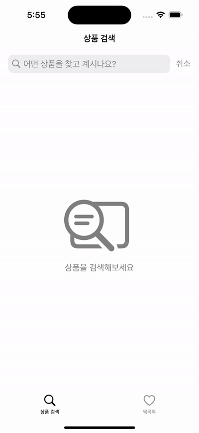
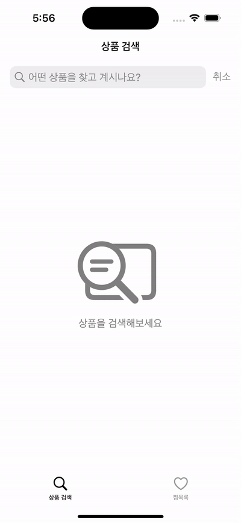

  

# Nshop

상품을 검색하고 마음에 드는 상품을 저장할 수 있는 앱

|||||
|:-:|:-:|:-:|:-:|
|검색|필터|상세 화면|무한 스크롤|
||||
|찜목록|찜목록 검색|찜목록 삭제|


## 목차

[프로젝트 정보](#프로젝트-정보)  
[주요 기능](#주요-기능)  
[기술 스택](#기술-스택)  
[구현 내용](#구현-내용)  
[문제 및 해결](#문제-및-해결)  
[회고](#회고)

## 프로젝트 정보

- 최소 버전: iOS 13.0
- 개발 환경: Xcode 14.3.1, swift 5.8.1
- 개발 기간: 23.09.07 ~ 23.09.11 (5일)
- 개발 인원: 1명

## 주요 기능

- 상품 검색 기능
- 상품 정렬 기능
- 찜 목록 추가/삭제 기능

## 기술 스택

- `UIKit`
- `MVC` `CodebaseUI`
- `WebKit` `Network` `URLSession`
- `SnapKit(5.6.0)`
- `Realm(10.42.1)`

## 구현 내용

- 네이버 쇼핑 검색 API를 이용한 상품 검색 기능
- Webkit을 이용한 상품 상세페이지 구현
- Network 프레임워크를 이용한 네트워크 연결 상태 확인 기능
- Realm DB를 이용한 마음에 드는 상품 저장 기능
- Realm의 filter 기능을 활용한 찜목록에 저장된 상품 검색 기능
- prefetchltemsAt 메서드를 사용한 무한 스크롤 구현

## 문제 및 해결

### 1. 실시간 검색 기능

#### 🚨 문제 상황

UISearchBarDelegate에 있는 textDidChange 메서드를 사용하여 사용자가 검색어를 입력할 때마다 return key를 누르지 않더라도 네트워크 요청을 실행하고 상품이 View에 나타나도록 함
-> 모든 입력에 대해서 textDidChange 메서드가 실행되어 불필요하게 많은 네트워크 요청 발생 (ex. ‘아이폰' 검색시 ㅇ, 아, 앙, 아이, 아잎, 아이포, 아이폰 의 단어로 무려 7번의 요청 발생)

#### ✅ 해결

Debounce와 Throttle에 대해서 학습
- Debounce
	- 동일 이벤트가 반복적으로 시행되는 경우, 마지막 이벤트가 실행되고나서 일정 시간동안 이벤트가 다시 실행되지 않았을 때 콜백 함수 실행
- Throttle
	- 동일 이벤트가 반복적으로 시행되는 경우, 이벤트의 실제 반복 주기와 상관없이 임의로 설정한 시간 간격으로 콜백 함수 실행

입력이 연속적으로 들어오는 경우, 마지막 입력이 들어왔을 때만 네트워크 통신을 수행하기 위하여 debounce를 적용하여 메서드를 호출하기로 함

##### `DispatchWorkItem`를 이용하여 Debouncer 구현

```swift
class Debouncer { 
	private var workItem: DispatchWorkItem?
	private let seconds: Int
	
	init(seconds: Int) {
		self.seconds = seconds
	}
	
	func run(_ closure: @escaping () -> ()) {
		self.workItem?.cancel()
		
		let newWork = DispatchWorkItem(block: closure)
		workItem = newWork
		
		DispatchQueue.main.asyncAfter(deadline: .now() + .seconds(seconds), execute: newWork)
	}
}
```

- workItem이 있다면 작업 제거
- 클로저로 받은 작업을 seconds 후에 수행

##### Debouncer 사용

```swift
private let debouncer = Debouncer(seconds: 1)
```

```swift
extension ProductSearchingViewController: UISearchBarDelegate {
	func searchBar(_ searchBar: UISearchBar, textDidChange searchText: String) {
	    debouncer.run { [unowned self] in
	        setFirstSearch()
	        firstFetch()
	    }
	}
}
```

|||
|:-:|:-:|
|before|after|

### 2. pagination

#### 🚨 문제 상황

대량의 데이터를 한 번에 불러오는 것은 서버에 부담을 주고, 사용자 경험을 저하시키므로, 데이터를 적절히 나누어서 불러와야 함.  
이전에는 'page' 값을 이용해 이후 데이터를 불러왔었는데, 네이버 쇼핑 검색 API는 response에 page 값을 별도로 제공하지 않음.

#### ✅ 해결

응답으로 온 total(총 검색 결과 개수), start(검색 시작 위치), display(한 번에 표시할 검색 결과 개수)값들을 활용하여 offset-based pagination을 구현

```swift
    var products: [Product] = []
    
    var total = 0
	var page = 1
	let display = 30

	var isEnd: Bool {
		// page와 total/display 값이 같은 경우는 나머지 제품들 보여주고 있을 것
		// page가 total/display보다 커야 더이상 불러올 제품 없음!
        return page > total / display
    }

    var start: Int {
		// 1page: 1
		// 2page: 31
		// 3page: 61
        return display * (page - 1) + 1
    }
```

```swift
func collectionView(_ collectionView: UICollectionView, prefetchItemsAt indexPaths: [IndexPath]) {
    for indexPath in indexPaths {
        if products.count - 1 == indexPath.item && !isEnd {
            page += 1
            
            guard let productName = searchBar.text, !productName.isEmpty else { return }
            
            searchManager.fetchProduct(name: productName, display: display, start: start, sort: sort.text) { data in
                self.total = data.total
                self.products.append(contentsOf: data.items)
                
                DispatchQueue.main.async {
                    self.productCollectionView.reloadData()
                }
            }
        }
    }
}
```
`products.count - 1 == indexPath.item` 불러온 제품 다 보여줘 가고, `isEnd == false`일 때
- page += 1
- 다음 페이지 데이터 배열에 추가해주기


## 회고

### Massive ViewController

MVC 패턴을 사용하여 아키텍처를 구성하였는데, 모든 코드를 ViewController에 작성하다 보니 개발이 진행될수록 원하는 부분을 찾기가 어려워졌습니다. 간단한 검색화면 만드는 데에도 스크롤이 길어진 것을 보며, 규모가 큰 프로젝트를 MVC로 개발하면 어떤 문제가 발생할지 직접 경험해보게 되었습니다. 이를 통해 코드를 분리하고 다양한 아키텍처 패턴이 등장하는 이유를 몸소 느낄 수 있었습니다. 이번 경험을 바탕으로 다음 프로젝트에서는 MVVM 패턴에 도전해보고자 합니다.
